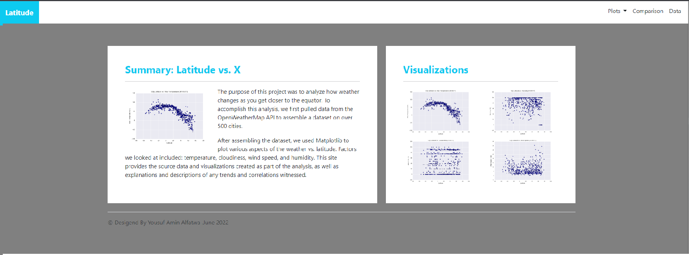
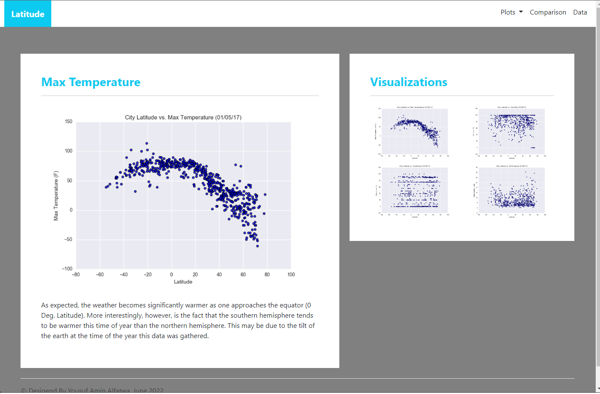
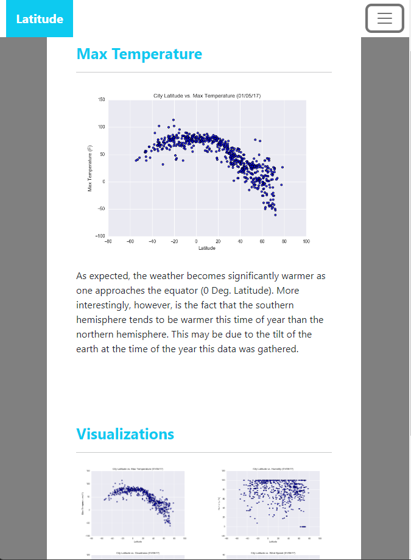
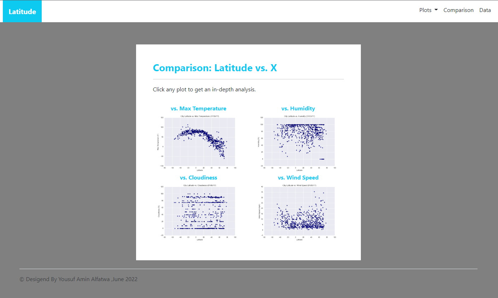
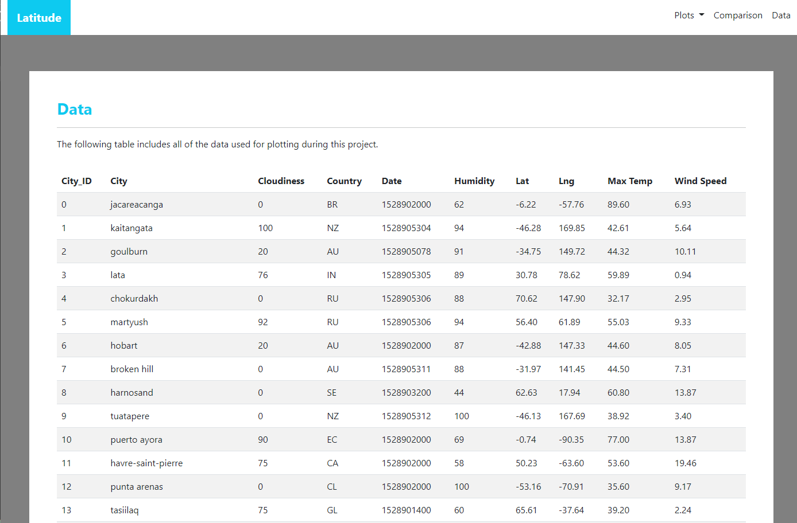

# Web Visualization Dashboard (Latitude)

I created a visualization dashboard website for my previous project work. Specifically, we'll be plotting [weather data](Resources/cities.csv), and the original GitHub repository found here [python-api-challenge](https://github.com/yaf978/Python_api_challenge)

In building this dashboard, I created individual pages for each plot and a means by which we can navigate between them. These pages will contain the visualizations and their corresponding explanations. I also created a landing page, a page where we can see a comparison of all the plots, and another page where we can view the data used to build them.

### Website Contents

The website consist of 7 pages total, including:

### 1. Home page (index)
  * Containing an explanation of the project.
  * Links to each visualization page. A sidebar contains preview images of each plot, and clicking an image will take to that visualization.
  * 
 
  ---
### 2. Four visualization pages 
  * With a descriptive title and heading tag.
  * The plot/visualization itself for the selected comparison.
  * A paragraph describes the plot and its significance.
  
Large screen:

---
Small screen:

---
### 3. Comparisons page
  * Contains all of the visualizations on the same page so we can easily visually compare them.
  * I used a Bootstrap grid for the visualizations.
  * The grid has two visualizations across medium and larger screens and one across on extra-small and small screens.
 
---
                                   
### 4. Data page
  * On the data page, I displayed a responsive table containing the data used in the visualizations.
    * The table is constructed by using a bootstrap table component.
    * The data come from exporting the `.csv` file as HTML.
    * 

